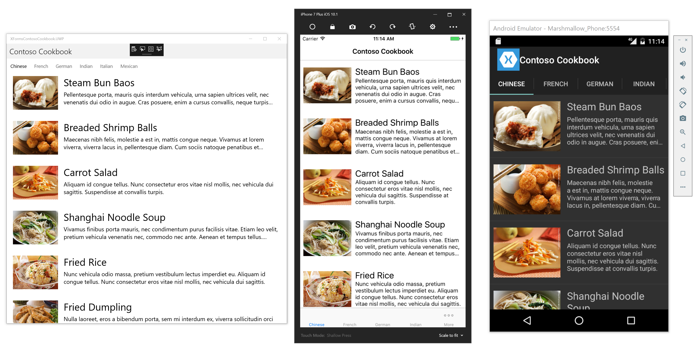

# Contoso Cookbook example for Xamarin.Forms

This code was written by Jeff Prosise @ Wintellect as a port of his excellent Contoso Cookbook example for Windows 8 and then UWP. He [blogged all about the experience](http://www.wintellect.com/devcenter/jprosise/building-contoso-cookbook-with-xamarin-forms) and also did a [great Xamarin University Guest Lecture](https://university.xamarin.com/guestlectures/porting-windows-and-windows-phone-apps-to-xamarinforms) which has some great tips and tricks.

I modified his original example to update the Xamarin.Forms dependency, replace the Windows 8.1 project with a UWP project, and change the custom renderer to an effect which is the better way to solve the text label wrapping issue he encountered. However, this is still very much his code - I am posting it here for reference and to make it a bit easier to find and download - as well as to keep it updated as Forms evolves.

## Project basics

It's a fairly simple program which displays recipes from a built-in list. The solution has four projects:

1. The PCL core library where most of the code and UI lives.
2. An iOS head project
3. An Android head project
4. A Universal Windows head project.

## Running the project yourself

Android and UWP should deploy and run pretty much anywhere. The iOS project uses the bundle id prefix "com.xamarin", so to run it you will need to change that to be something that you have a provisioning profile for.
